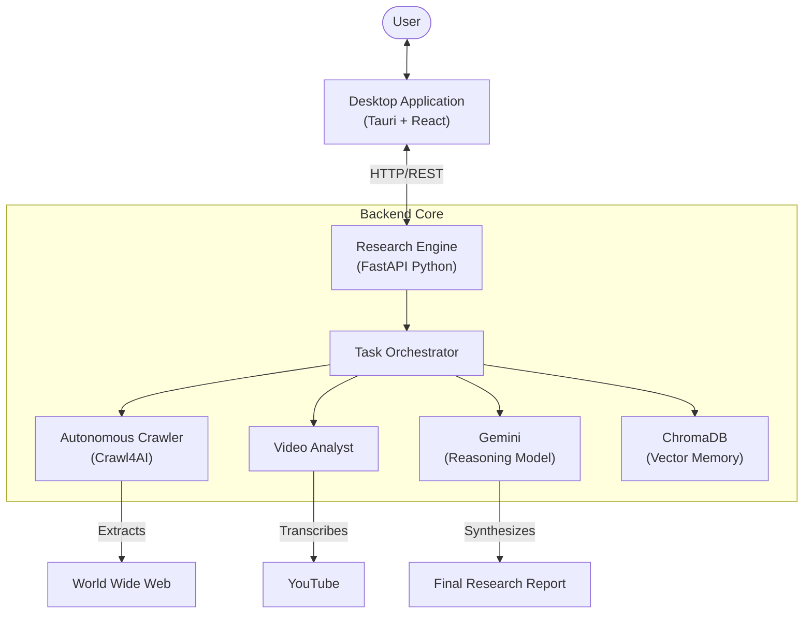

# Deep Researcher
<div align="center">
  
  <br />
  <p><em>Autonomously Synthesizing Global Knowledge</em></p>
</div>

---

**Deep Researcher** is a state-of-the-art research assistant that combines the power of **Generative AI** with autonomous web crawling to deliver deep, evidence-based insights. Designed for professionals who demand more than just surface-level answers, it acts as a tireless analyst, synthesizing data from across the web, video content, and structured databases into comprehensive reports.

## System Overview

Deep Researcher operates as a hybrid desktop application, ensuring privacy, performance, and a seamless user experience.



## Component Documentation

The project is structured into two main components. Please refer to their respective documentation for detailed setup and contribution guides.

### [Frontend Application](./app/README.md)
The user-facing desktop shell.
-   **Tech**: Tauri v2, React, TailwindCSS v4.
-   **Role**: UI/UX, Visualization, User Interaction.

### [Backend Engine](./backend/README.md)
The intelligence core.
-   **Tech**: Python 3.12, FastAPI, Google Gemini.
-   **Role**: Web Scraping, Data Processing, AI Inference.

## Quick Start Guide

1.  **Clone the repository**:
    ```bash
    git clone https://github.com/StartUp-Pioneers/Deep-Researcher.git
    cd Deep-Researcher
    ```

2.  **Setup the Backend**:
    Follow the [Backend Setup Guide](./backend/README.md#getting-started) to configure your `.env` and install dependencies via `uv`.

3.  **Launch the Frontend**:
    Follow the [Frontend Setup Guide](./app/README.md#getting-started) to install Node modules and start the interface.

---

> "The goal is not just to search, but to understand."  
> — *pixelThreader & Team*
